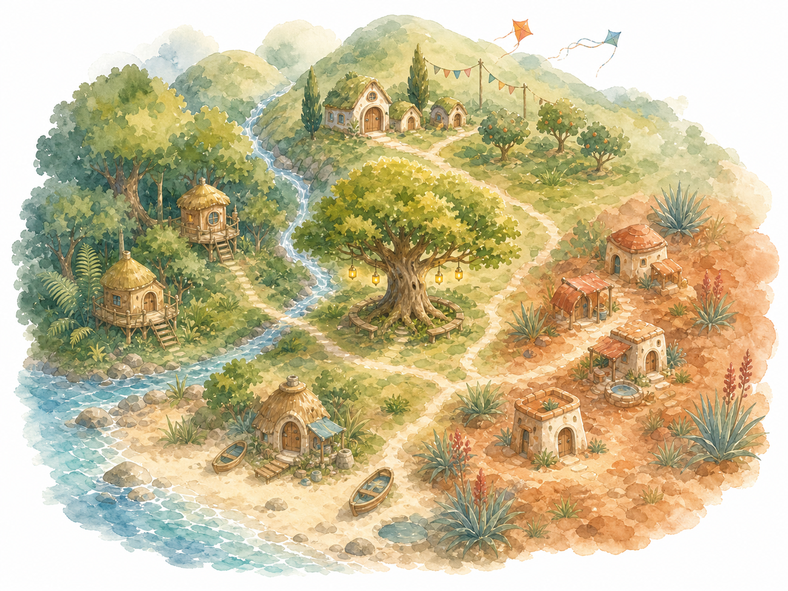

# Lanternleaf geography and villages

**Status:** Exploration v0.1

**Purpose:** Define a small, varied world that can sustain travel adventures and
simple early-reader stories

## What to call its communities

Use **village** as the general child-facing word. It is warm, concrete, familiar,
and easy to understand across the reading ladder. Internal planning may use
**community** or **settlement** when speaking generically, but those words do not
need to appear in the stories.

The whimsy should come from each proper name rather than one invented category.
A coastal village may be a Cove, a sheltered forest village a Grove or Hollow,
and a hill village a Hill or Height. This gives every place its own geographic
identity while narration can still say, "They came to a village by the sea."

Avoid using one suffix everywhere. Also avoid relying on these as the shared
world term:

- **hamlet** is precise but less familiar to beginning readers;
- **borough** sounds larger and more civic than this world needs;
- **burrow** implies a particular kind of animal home;
- **settlement** is useful documentation language but emotionally dry; and
- an invented lore word would add vocabulary without improving the stories.

## Naming grammar

Place names should sound whimsical but remain easy to say, remember, and
eventually decode.

- Prefer one or two familiar concrete words.
- Let the name describe something visible in the place.
- Keep pronunciation obvious.
- Use varied geographic endings instead of a uniform branded suffix.
- Avoid apostrophes, decorative spelling, dense alliteration, and names that
  sound generated by combining unrelated fantasy words.

Working names in this document are intentionally plain. They can become more
distinctive after the geography and cultures are approved.

## Shape and scale of the world

Lanternleaf is a compact coastal region rather than one endless forest. Hills
rise along one side, a broad woodland occupies its wetter middle, the land opens
to the sea, and the far side becomes warmer and drier behind the hills. This
supports several strong environments without making a beach, deep forest, and
dry country feel artificially placed beside one another.

The dry region is not a vast sand desert. It is a sun-warmed landscape of pale
grass, low silver-green plants, terracotta earth, smooth stone, hardy flowers,
and deep shade. The change is large enough to feel adventurous but still
belongs to the same small world.

The four villages are close enough to share history and remember one another,
but far enough apart that reaching the next one is a real journey. Exact travel
times remain undefined until the primary episode outline establishes the right
story rhythm.

## Working geography

## Geography visualization

This image is a **superseded scale exploration**, not the target map treatment.
It established the broad spatial reading:

- **top:** Kite Hill and the northern hills;
- **left:** Mossgrove in the center-west forest;
- **lower left:** Pebble Cove on the sheltered coast;
- **right:** Sunbank in the warm dry country; and
- **center:** the Meeting Tree and the main path crossings.

It renders the world too close, like one neighborhood seen as an aerial
diorama, and overcommits to individual dwellings before settlement design. The
next map must pull back to a regional story-atlas scale where coastline, rivers,
hills, forest, and dry country dominate. Villages should appear only as subtle
location marks or clearings; individual homes and streets do not belong on this
map.

Names remain outside generated art while working names change. Final labels can
be added deliberately after geography is approved rather than entrusted to an
image model. Generation and selection provenance is recorded in
[`geography-map-production.md`](geography-map-production.md).

### Regional map art direction

Use the attached external-world reference only for **scale and cartographic
hierarchy**:

- a high, nearly flat top-down atlas view rather than a three-quarter aerial
  scene;
- one broad landmass and coastline readable before any local details;
- biomes expressed as large watercolor regions and repeated terrain marks;
- mountains, hills, rivers, forest, shore, and dry country as the primary
  visual vocabulary;
- paths as fine organic connections across the land;
- villages represented by restrained location marks, not illustrated homes;
  and
- the Meeting Tree as one small landmark within the map, not a giant foreground
  object.

Do not copy the reference world's geography, names, border, aged paper, dark
ocean, typography, or specific symbols. Lanternleaf retains its clean white
matte, airy watercolor medium, gentle palette, organic contours, and original
coast-to-hills geography.

### Mossgrove — the forest village

**Role:** Fern and Pip's working home village

Mossgrove sits among old roots, broad ferns, shaded gardens, and small clearings
in the middle woodland. Rounded homes grow into stumps and root systems rather
than standing apart from the forest. Worktables, map shelves, plant pots, hooks,
and useful handmade objects make it feel inhabited.

Its residents know local plants, woodland routes, paper craft, drawing, and
small-scale making. Fern's mapmaking belongs naturally here without making every
resident a mapmaker.

Story material includes familiar routines, getting lost close to home, noticing
small changes, caring for gardens, borrowing tools, and learning that a known
map is not the same as the living world.

**Path expression:** Leaves and stems loosely align, a soft opening appears
between plants, and occasional warm leaf undersides help the eye follow the way.

### Pebble Cove — the sea village

**Role:** The coastal edge of Lanternleaf

Pebble Cove gathers around a sheltered beach with rounded stones, shallow tide
pools, dune grass, small boats, and homes tucked above the waterline. Its forms
remain organic and handmade: curved roofs, driftwood rails, woven grass shades,
shell-marked steps, and baskets for carrying wet things.

Residents understand tides, changing weather, boats, sea plants, knots, and the
rhythm of departures and returns. The coast introduces a wider horizon without
requiring Lanternleaf to become a large ocean-faring world.

Story material includes waiting for the tide, finding what washed ashore,
sharing limited boat space, welcoming arrivals, returning borrowed things, and
distinguishing what should be collected from what should remain in a tide pool.

**Path expression:** Dune grass parts irregularly, familiar stones and shell
fragments become visible, and a walkable curve through the beach plants can be
recognized again.

### Kite Hill — the hill village

**Role:** The high, windy viewpoint

Kite Hill sits among rounded slopes, meadow grass, low orchard terraces, and
wide views across Lanternleaf. Homes nestle into hillsides with sheltered doors,
small windbreaks, cloth streamers, and practical outdoor racks. Kites may be a
recurring pastime and tool, but they should not decorate every surface.

Residents are attentive to wind, clouds, distance, and changes that can be seen
from high ground. They tend hill gardens and orchards and are accustomed to
carrying light things carefully in strong breezes.

Story material includes seeing far but missing what is close, cooperating in
wind, sending or misreading signals, retrieving a runaway object, preparing for
weather, and learning that a broad view is still only one perspective.

**Path expression:** Meadow grass leans unevenly away from a worn line, low
stones become visible, and the next rise provides a natural directional cue.

### Sunbank — the warm, dry village

**Role:** The sun-warmed far side of Lanternleaf

Sunbank rests among terracotta banks, smooth pale stone, hardy gardens, shaded
courtyards, and carefully tended water. Homes use rounded earthen forms, deep
awnings, open shelves, clay vessels, and climbing plants trained for shade.

Residents understand clay, heat, water care, preserving food, and making a
little go a long way. The village should feel bright and abundant in its own
way, never barren, exoticized, or defined only by scarcity.

Story material includes finding shade, carrying water without spilling,
sharing something carefully saved, repairing cracked clay, waiting for the cool
part of the day, and discovering life in places that first look quiet.

**Path expression:** Low plants open around a passable line, flat stones emerge
from pale grass or dust, and sparse leaves turn their lighter sides toward the
route.

## The shared center

A great meeting tree stands near the middle of Lanternleaf where routes from
different regions once crossed. It is a gathering place rather than a fifth
village. The tree can anchor the living map and the primary journey without
being the source of all magic or the object that repairs every path.

Its final name and exact role remain open. Calling it simply **the Meeting Tree**
during development keeps the story function clear.

## Connection without rigid economies

The villages should rely on one another, but they should not function like four
single-purpose factories. Geography shapes knowledge, habits, materials, and
stories without deciding every resident's personality.

Connections may involve:

- visits between friends and relatives;
- shared celebrations and seasonal work;
- letters, invitations, and news;
- tools, ingredients, seeds, clay vessels, baskets, and repairs;
- weather or tide knowledge passed between regions; and
- help that moves in different directions at different times.

Each lost path should therefore represent one specific neglected relationship
or shared activity, not a claim that an entire village has one flaw.

## Biome-wide visual continuity

All regions retain Lanternleaf's airy watercolor-and-ink language, organic
vignette edges, restrained local-color contours, semantic environmental detail,
and clean solid-white surround. Geography changes the dominant shapes and
palette without changing the medium.

The living paths adapt to local terrain. Forest leaves should not be pasted onto
a beach or dry hillside merely to repeat a motif. The shared magic is that the
land quietly makes a route recognizable in its own materials.

Because Lanternleaf is no longer exclusively a forest, the core promise may
eventually read, "When connection returns, **Lanternleaf** opens the way," rather
than, "the forest opens the way." This wording change remains pending owner
approval.

## Character-distribution opportunity

The main group can assemble across the geography rather than beginning as four
friends from one home. Fern and Pip start in Mossgrove; the Maker and Listener
may come from later villages. Giving companions different home regions makes
their knowledge useful and gives the journey personal stakes.

Exact origins should be decided with the character bible, not inferred from
species stereotypes.

## Decisions to make next

- Confirm whether Lanternleaf is a coastal region, peninsula, or island.
- Approve the four-biome structure before final place naming.
- Decide whether all four villages belong in the first primary arc.
- Replace or approve the working names Mossgrove, Pebble Cove, Kite Hill, and
  Sunbank.
- Define the Meeting Tree only after deciding what the final journey requires.
