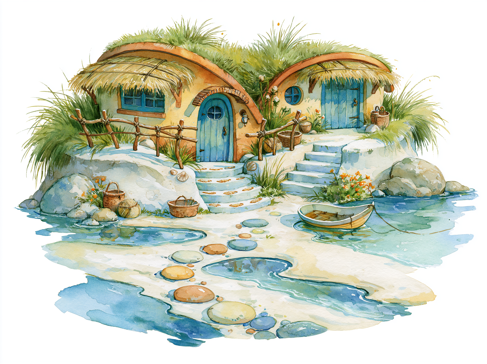
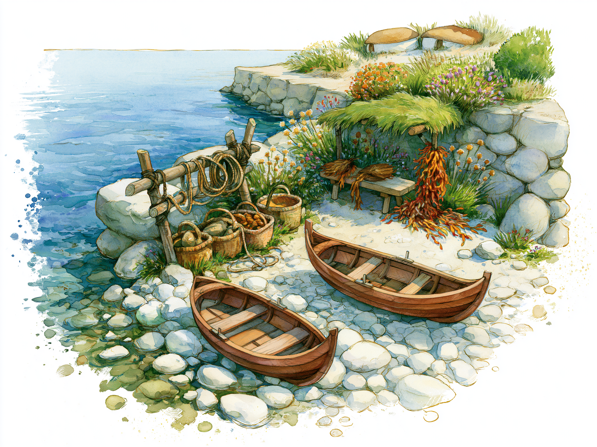
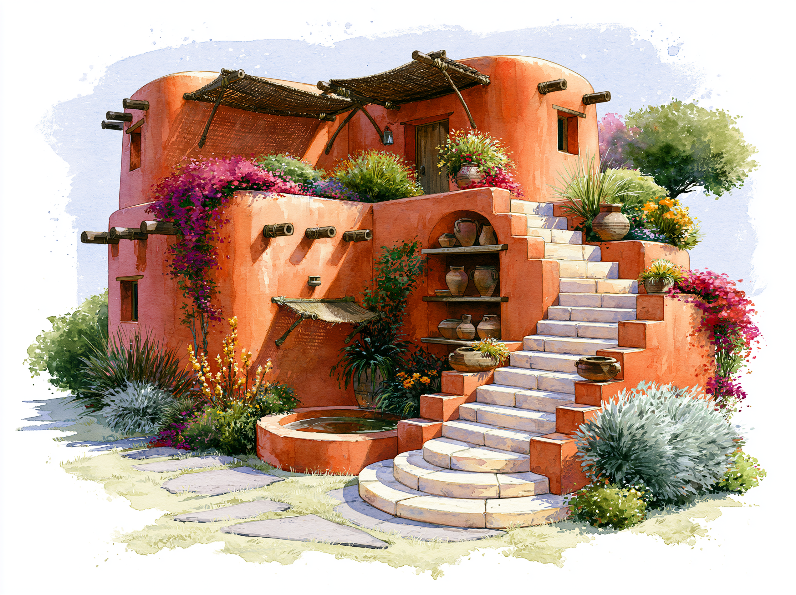
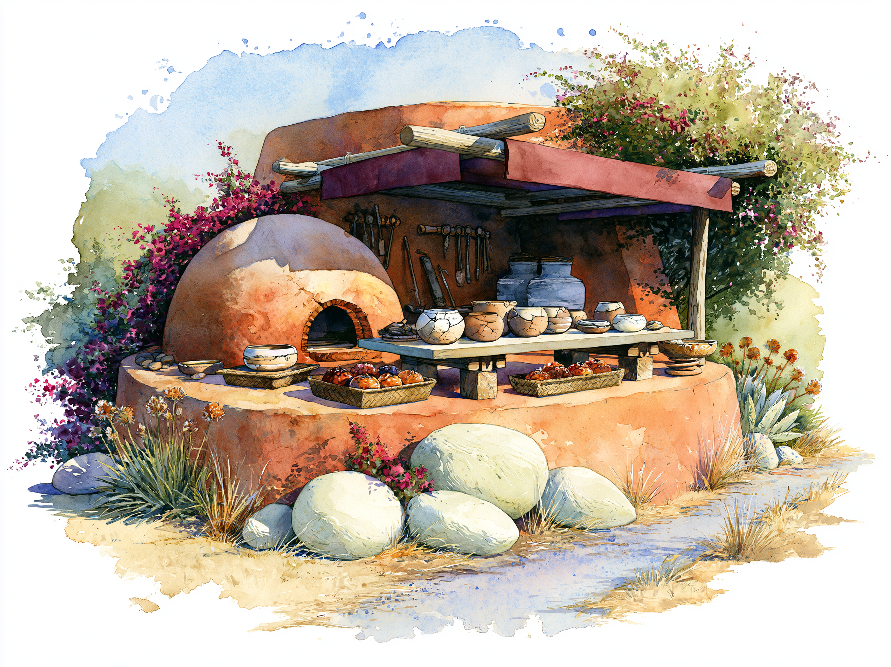
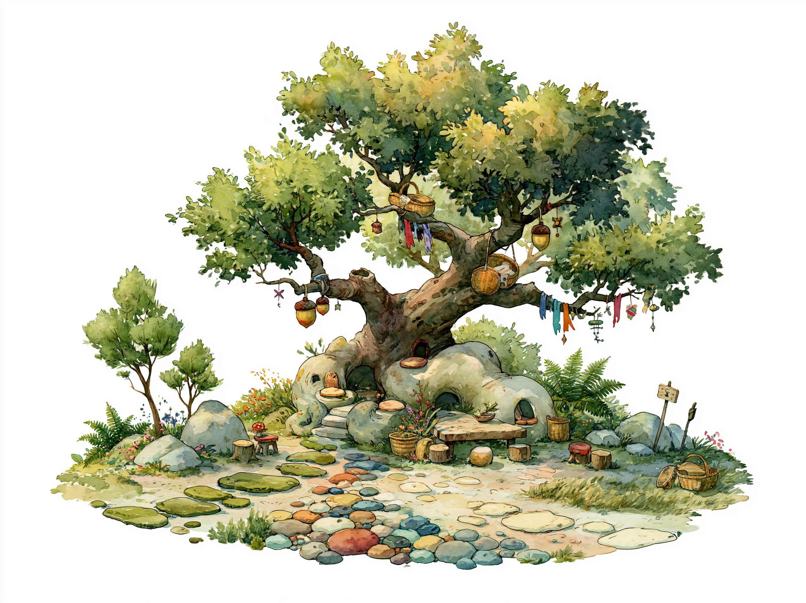
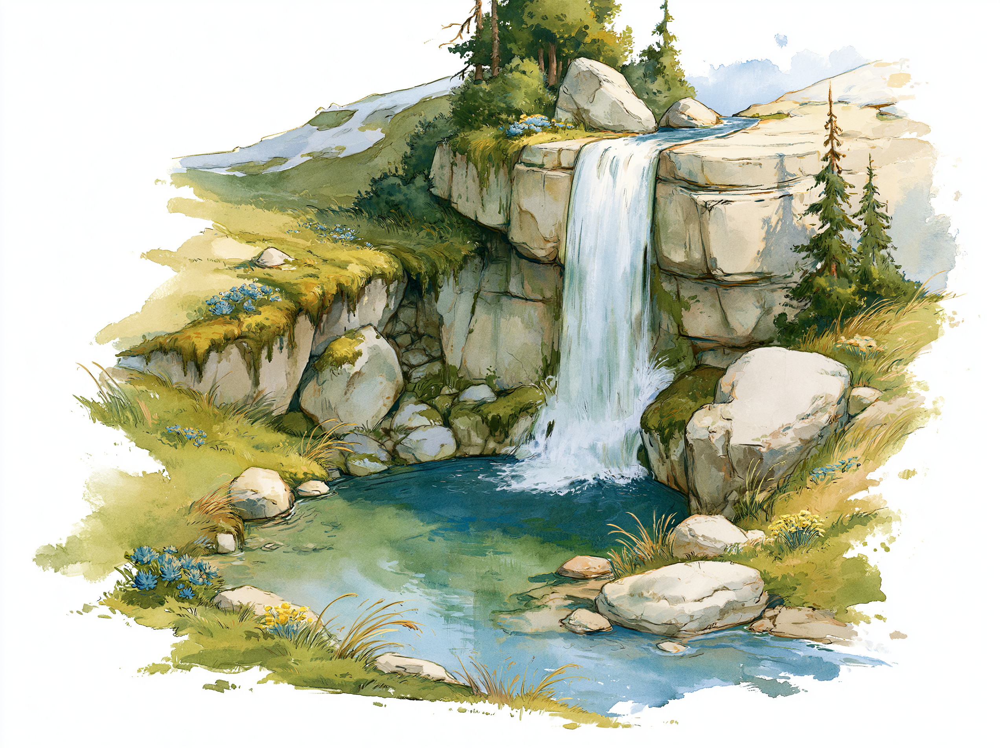
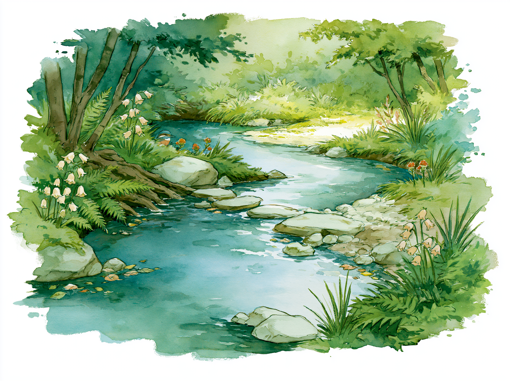

# Lanternleaf village and landmark scene references

**Status:** Working

These environment studies develop villages and shared landmarks at story-scene
scale. They establish useful visual vocabulary without making every pictured
object mandatory in every story.

## Shared scene treatment

Use stark sunshine and vivid, diverse color to counter Midjourney's tendency
toward dark, monochromatic forest scenes. Keep broad watercolor strokes inside
an airy floating vignette whose loose wet-on-wet edges dissolve into pure white
on all sides. Favor simple readable forms and inhabited details over dense
texture.

The current Midjourney baseline is:

```text
--no people, animals, text --ar 4:3 --raw --v 8.1 --hd
```

Add optional parameters only when a scene demonstrates a clear need for them.

Final story media uses an exact 4:3 frame and the story package's solid matte.
Exploration images with textured or tinted surrounds require matte cleanup
before production use.

## Mossgrove

### Root lane beside Winkwater


This study establishes root-integrated homes, rounded blue doors, varied
scalloped awnings, small lanterns, practical work surfaces, abundant ferns,
potted plants, stepping stones, and modest crossings over Winkwater. These are
compatible Mossgrove elements, not a standard layout for every lane.

The stored image is a visual reference. Normalize its frame and textured paper
surround to the active package matte before using it as production media.

**Current prompt**

```text
Whimsical watercolor forest storybook illustration with stark sunshine, vivid and diverse colors; scene: homes grown into ancient tree roots with rounded blue doors and scalloped awnings, a mossy stepping-stone path beside a narrow stream and tiny wooden bridge, abundant ferns, pale bell flowers, potted herbs, and a mapmaker's worktable. Airy floating vignette with loose wet-on-wet edges dissolving into pure white on all sides, broad brushstrokes, simple forms, and restrained detail. --no people, animals, text --ar 4:3 --raw --v 8.1 --hd
```

### Paper garden


This study develops Mossgrove's paper craft and gardens without repeating
Winkwater, the bridge, or the residential lane. Broad worktables, drying paper,
plant dyes, baskets, seedlings, and acorn lanterns make the village feel useful
and inhabited. Its near-white surround still requires exact matte normalization
before production use.

```text
Whimsical watercolor forest storybook illustration with stark sunshine, vivid and diverse colors; scene: a sheltered paper garden beneath arching tree roots, with an open stump workshop, broad tables of handmade paper drying, baskets of leaves, plant-dye jars, hanging blank sheets, seedling beds, potted ferns, acorn lanterns, and a winding leaf-parted path, no stream. Airy floating vignette with loose wet-on-wet edges dissolving into pure white on all sides, broad brushstrokes, simple forms, and restrained detail. --no people, animals, text --ar 4:3 --raw --v 8.1 --hd
```

## Pebble Cove

### Tide-pool lane



This study establishes curved dune-integrated homes, sea-blue doors, woven
grass awnings, driftwood rails, shell-marked steps, rounded pebble paths,
shallow tide pools, and a small handmade boat.

```text
Whimsical watercolor coastal storybook illustration with stark sunshine, vivid and diverse colors; scene: Pebble Cove at low tide, with curved homes tucked into a grassy dune above the waterline, sea-blue doors, woven grass awnings, driftwood rails, shell-marked steps, rounded pebble paths, shallow tide pools, baskets, dune flowers, and one tiny handmade boat. Airy floating vignette with loose wet-on-wet edges dissolving into pure white on all sides, broad brushstrokes, simple forms, and restrained detail. --no people, animals, text --ar 4:3 --raw --v 8.1 --hd
```

### Return landing



This study develops Pebble Cove's working shoreline through small curved boats,
coiled rope, woven carrying baskets, drying sea plants, a shared grass-roofed
shelter, and abundant dune flowers. Both Pebble Cove studies require exact
frame and matte normalization before production use.

```text
Whimsical watercolor coastal storybook illustration with stark sunshine, vivid and diverse colors; scene: a sheltered Pebble Cove landing with two small curved wooden boats resting on smooth pale pebbles, a driftwood rack with coiled ropes, woven carrying baskets, sea plants drying beside a shared bench under a grass shade, shallow blue water, dune flowers, and rounded homes safely above the tide. Airy floating vignette with loose wet-on-wet edges dissolving into pure white on all sides, broad brushstrokes, simple forms, and restrained detail. --no people, animals, text --ar 4:3 --raw --v 8.1 --hd
```

## Kite Hill

### Windy orchard lane


This study establishes hillside-integrated homes, sheltered blue-green doors,
low windbreaks, cloth streamers, orchard terraces, a climbing meadow path, and
wide views toward the northern ridge.

```text
Whimsical watercolor hill-country storybook illustration with stark sunshine, vivid and diverse colors; scene: Kite Hill on a breezy ridge, with rounded homes tucked into grassy slopes, sheltered blue-green doors, low stone windbreaks, cloth streamers bending in the wind, a worn meadow path climbing between orchard terraces, baskets of apples, and a faint snow-tipped ridge in the distance. Airy floating vignette with loose wet-on-wet edges dissolving into pure white on all sides, broad brushstrokes, simple forms, and restrained detail. --no people, animals, text --ar 4:3 --raw --v 8.1 --hd
```

### Kite-making terrace


This study establishes a practical wind-craft terrace, a grass-roofed shelter,
light frames, cloth, string, outdoor racks, and a wind-protected garden. Use it
for setting vocabulary; incidental wildlife is not a required village element.
Both Kite Hill studies require exact frame and matte normalization before
production use.

```text
Whimsical watercolor hill-country storybook illustration with stark sunshine, vivid and diverse colors; scene: a sheltered Kite Hill workshop terrace beneath a curved grass roof, with two handmade kites, light wooden frames, cloth pieces, spools of string, a practical outdoor rack, a low orchard, windbreak hedges, leaning meadow grass, and wide views across Lanternleaf. Airy floating vignette with loose wet-on-wet edges dissolving into pure white on all sides, broad brushstrokes, simple forms, and restrained detail. --no people, animals, text --ar 4:3 --raw --v 8.1 --hd
```

## Sunbank

### Shaded water courtyard



This study establishes rounded terracotta homes, deep woven shade structures,
pale stone stairs, open vessel shelves, carefully tended water, vivid
bougainvilleas, and hardy silver-green planting.

```text
Whimsical watercolor warm-country storybook illustration with stark sunshine, vivid and diverse colors; scene: a bright and carefully tended Sunbank courtyard, with rounded terracotta homes, deep woven awnings, pale stone steps, open shelves of clay vessels, one small shaded water basin, bougainvilleas, hardy flowers, silver-green plants, and patches of pale grass. Airy floating vignette with loose wet-on-wet edges dissolving into pure white on all sides, broad brushstrokes, simple forms, and restrained detail. --no people, animals, text --ar 4:3 --raw --v 8.1 --hd
```

### Clay repair terrace



This study develops Sunbank's practical craft life through an earthen kiln,
repaired pottery, clay tools, preserved food, deep shade, hardy grasses, and
bougainvilleas. Both Sunbank studies require exact frame and matte
normalization before production use.

```text
Whimsical watercolor warm-country storybook illustration with stark late-afternoon sunshine, vivid and diverse colors; scene: a shaded Sunbank clay workshop on a terracotta bank, with a small rounded earthen kiln, a broad table of cracked and carefully mended pots, clay tools, water jars beneath a deep awning, woven trays of preserved fruit, smooth pale stones, bougainvilleas, hardy flowers, and a narrow path through dry grass. Airy floating vignette with loose wet-on-wet edges dissolving into pure white on all sides, broad brushstrokes, simple forms, and restrained detail. --no people, animals, text --ar 4:3 --raw --v 8.1 --hd
```

## Shared landmarks

### Heartwood gathering place



This study establishes Heartwood as a useful shared gathering place at the
route crossings rather than a fifth village. The great spreading tree, open
root rooms, communal tables and stools, baskets, path markers, acorn lanterns,
and small handmade tokens suggest visits and exchange among regions. These
details are setting vocabulary, not evidence that Heartwood is a dwelling, a
government center, the source of Lanternleaf's magic, or an automatic solution
to the fading paths. Its exact narrative role remains open.

The stored image is a visual reference. Normalize its frame and near-white
surround to the active package matte before using it as production media.

### Silverdrop Falls



This study establishes the small northern-ridge waterfall as Winkwater's single
visible source: one clear fall over pale stone, a receiving pool, subtle
snowfields, sparse evergreens, hill grasses, and hardy blue flowers. The image
defines landmark vocabulary rather than exact cliff geometry, scale, season,
or a story-specific route. Future scenes must not add a second visible source
for Winkwater.

The stored image is a visual reference. Normalize its frame and near-white
surround to the active package matte before using it as production media.

### Winkwater forest reach



This study establishes Winkwater within the wetter woodland: a clear winding
stream, varied shallow banks, water-smoothed stones, ferns, pendant bell
flowers, and soft sunlit openings. It is one representative forest reach, not
the river's fixed course or a requirement that every crossing use stepping
stones. Winkwater still begins only at Silverdrop Falls, flows continuously
through Mossgrove, and empties into Pebble Cove.

The stored image is a visual reference. Normalize its frame and near-white
surround to the active package matte before using it as production media.
