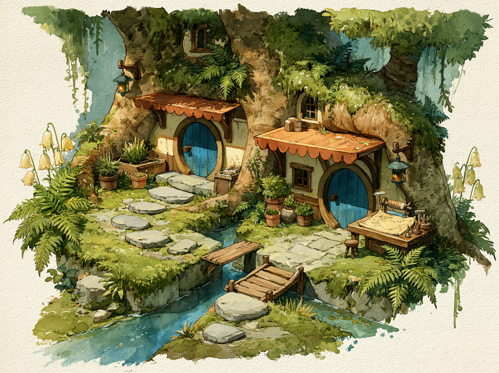

# Lanternleaf village scene references

**Status:** Working

These environment studies develop each village at story-scene scale. They
establish useful visual vocabulary without making every pictured object
mandatory in every story.

## Shared scene treatment

Use bright, gentle color and broad watercolor strokes inside an airy floating
vignette. Loose wet-on-wet edges dissolve into pure white on all sides. Favor
simple readable forms and inhabited details over dense texture.

Final story media uses an exact 4:3 frame and the story package's solid matte.
Exploration images with textured or tinted surrounds require matte cleanup
before production use.

## Mossgrove

### Root lane beside Winkwater



This study establishes root-integrated homes, rounded blue doors, varied
scalloped awnings, small lanterns, practical work surfaces, abundant ferns,
potted plants, stepping stones, and modest crossings over Winkwater. These are
compatible Mossgrove elements, not a standard layout for every lane.

The stored image is a visual reference. Normalize its frame and textured paper
surround to the active package matte before using it as production media.

**Current prompt**

```text
Whimsical watercolor forest storybook illustration with cozy morning sunshine and bright gentle colors; scene: homes grown into ancient tree roots with rounded blue doors and scalloped awnings, a mossy stepping-stone path beside a narrow stream and tiny wooden bridge, abundant ferns, pale bell flowers, potted herbs, and a mapmaker's worktable. Airy floating vignette with loose wet-on-wet edges dissolving into pure white on all sides, broad brushstrokes, simple forms, and restrained detail. --ar 4:3 --raw --v 8.1 --stylize 200 --hd --no people, animals, text
```

### Paper garden exploration

This second view should develop Mossgrove's paper craft and gardens without
repeating Winkwater, the bridge, or the same residential lane.

```text
Whimsical watercolor forest storybook illustration with soft afternoon sunshine and bright gentle colors; scene: a sheltered Mossgrove paper garden beneath arching tree roots, with an open stump workshop, broad tables of handmade paper drying, baskets of leaves, plant-dye jars, hanging blank sheets, seedling beds, potted ferns, acorn lanterns, and a winding leaf-parted path, no stream. Airy floating vignette with loose wet-on-wet edges dissolving into pure white on all sides, broad brushstrokes, simple forms, and restrained detail. --ar 4:3 --raw --v 8.1 --stylize 200 --hd --no people, animals, text
```
